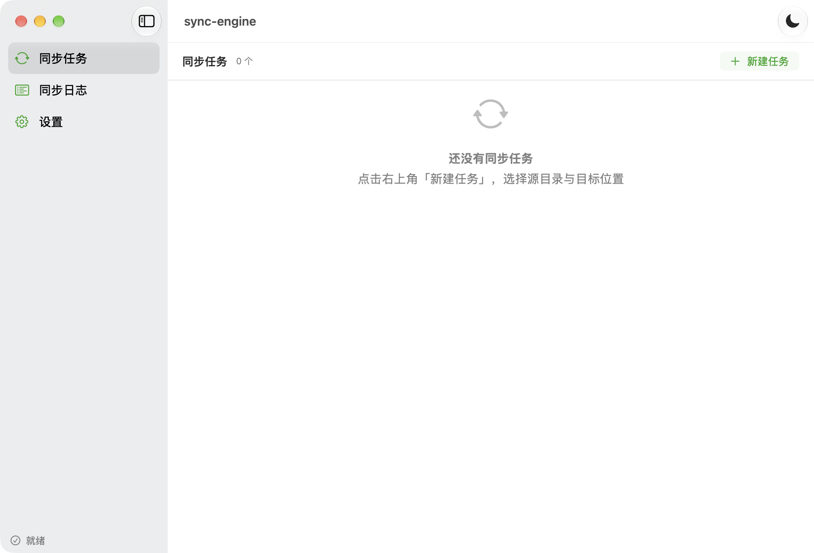
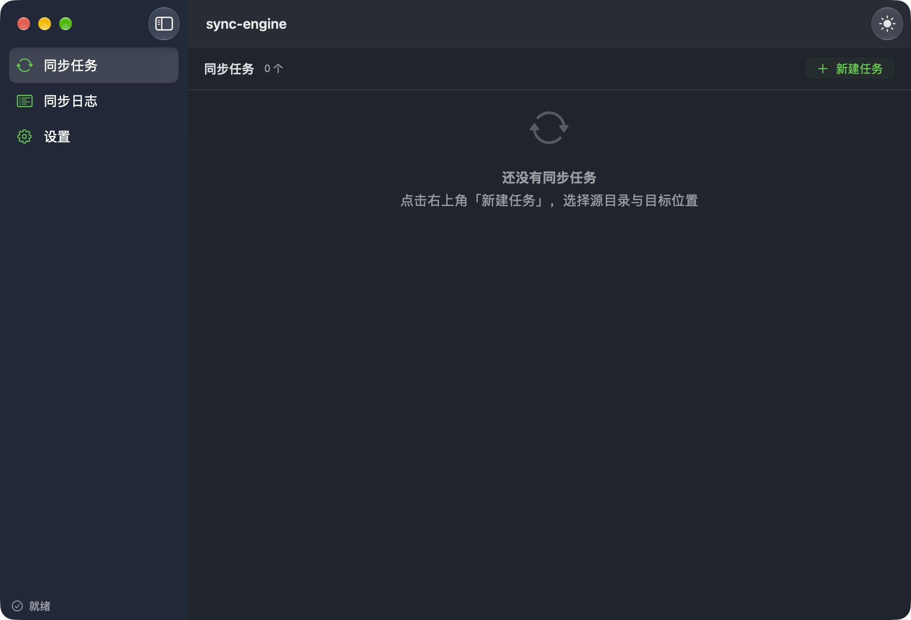

# SyncEngine-macOS

macOS 原生数据同步工具，使用 **SwiftUI** 构建（SwiftPM 手工打包，无 Xcode 工程文件依赖）。

面向的是「把一批目录稳妥地同步到另一个位置」这类需求：本地磁盘之间，或同步到局域网
NAS（SMB）与 WebDAV 服务器。核心引擎用 SHA-256 逐文件做内容指纹，用内容哈希而非修改时间
判断变更 —— 外接盘常是 FAT/exFAT（时间戳精度只有 2 秒），时钟也会漂移，靠时间戳判变更
必然出错。

> **当前版本是 v1.0.0，功能尚未完整。** 已完成的是**引擎、目标端连接与读写原语**；
> 三方比对、冲突裁决、增量同步与断点续传**尚未实现**。详见下方
> [当前进度与限制](#当前进度与限制) —— 请先读完那一节再决定是否使用。

## 功能

- **目录扫描与内容指纹** —— 递归遍历目录树，逐文件计算 SHA-256；显式栈实现，不跟随软链接
  （跟随软链接会导致目录环无限遍历、同一份内容被重复计入，统计数字直接失真）。
- **并发哈希** —— 多核并行，滑动窗口控制内存占用。实测 6.3 GB 目录树上
  10 路并发比串行快 4.2 倍（283 → 1179 MB/s）。
- **三个阶段分开计时** —— 遍历 / 哈希 / 合计分别统计。遍历受文件数主导、哈希受字节数主导，
  混在一起看不出瓶颈在哪。
- **本地目录目标端** —— 路径逃逸双重校验（词法 + 软链接解析，且校验目标自身）。
- **SMB 目标端** —— 走系统 NetFS 框架挂载后复用本地驱动，因此读写语义与本地目录天然一致。
  会自动复用已挂载的卷，不重复挂载。
- **WebDAV 目标端** —— URLSession 直发 `PROPFIND/PUT/MKCOL/DELETE`，自写 multistatus 解析。
  Basic / Digest 认证、可选中放行自签名证书。
- **凭据存系统钥匙串** —— 任务结构里只保存用户名，密码不落配置文件、不出现在日志里。
- **界面** —— 浅色 / 深色 / 跟随系统；任务可编辑；菜单栏常驻；关闭主窗口行为可选
  （退出软件 / 最小化到菜单栏）。

## 下载

| 机型 | 安装包 |
| --- | --- |
| Apple Silicon（M 系列） | [sync-engine-v1.0.0-arm64.dmg](https://github.com/zdx8/SyncEngine-macOS/releases/download/v1.0.0/sync-engine-v1.0.0-arm64.dmg) |
| Intel（x86_64） | [sync-engine-v1.0.0-x86_64.dmg](https://github.com/zdx8/SyncEngine-macOS/releases/download/v1.0.0/sync-engine-v1.0.0-x86_64.dmg) |

均为**临时签名、未公证**的版本。首次打开会被 Gatekeeper 拦下，这是预期行为而非缺陷：
把 `sync-engine.app` 拖进「应用程序」后**右键 → 打开**，或到
「系统设置 → 隐私与安全性」点「仍要打开」。放行一次即可，之后正常双击启动。

全部版本见 [Releases](https://github.com/zdx8/SyncEngine-macOS/releases)。

## 截图

浅色主题：



深色主题：



## 环境要求

- **macOS 14+**（Observation 框架与 `NavigationSplitView` 稳定可用的下限）
- **Swift 6**（Command Line Tools 或完整 Xcode）—— 仅构建时需要，运行不需要

无第三方依赖：界面与引擎只用系统框架（SwiftUI / Foundation / CryptoKit /
AppKit / Security / NetFS），构建脚本只用系统自带工具。

## 构建

```bash
cd SyncApp

swift build                 # 构建
swift test                  # 单元测试（76 项）
bash Scripts/build_app.sh   # 打包成 dist/sync-engine.app
```

无界面验证（跑的是**打包产物本身**，即真实交付路径）：

```bash
dist/sync-engine.app/Contents/MacOS/sync-engine --selfcheck [目录]
dist/sync-engine.app/Contents/MacOS/sync-engine --bench <目录> [并发数]
```

打发行版安装包：

```bash
bash Scripts/make_dmg.sh 1.0.0 arm64     # → dist/sync-engine-v1.0.0-arm64.dmg
bash Scripts/make_dmg.sh 1.0.0 x86_64    # → dist/sync-engine-v1.0.0-x86_64.dmg
```

## 验证方式

这套项目的验证原则是**不依赖肉眼**，分四层：

| 层 | 手段 | 覆盖 |
| --- | --- | --- |
| 引擎逻辑 | `swift test`（76 项） | 哈希向量、扫描统计、软链策略、路径逃逸、计时不变量、错误路径 |
| 存储驱动 | `swift test`（含真实 IO） | **对进程内真实 WebDAV 服务端**做完整往返；对**真实 SMB 挂载**做只读验证 |
| 交付产物 | `--selfcheck`（16 项） | 真实 `.app` 内那份二进制能否跑通引擎与驱动接线 |
| 界面渲染 | 单窗口截图 + 位图像素分析 | 主题一致性、强调色是否统一、内容是否真的画出来了 |

两条值得一提的做法：

- **断言验结构性不变量**，不验机器相关的具体数值。「分项耗时之和 ≤ 总耗时」这类断言
  不随机器快慢变化，而「耗时必须小于 3 秒」必然变成 flaky 测试。
- **只在某条操作路径上出现的缺陷，必须把那条路径本身做成可复现的。**
  静态启动验证再密也验不到「运行中切换主题」这类路径，所以应用里保留了一个
  走同一入口的诊断钩子（`--appearance-transition-test`，带参数才生效），
  配一个六场景的像素判据矩阵脚本 `Scripts/verify_appearance.sh`。

## 当前进度与限制

**已完成**：引擎（扫描 + 并发哈希 + 三阶段计时）、三种目标端驱动（本地 / SMB / WebDAV）
的连接与读写原语、钥匙串凭据、界面外壳与设置。

**尚未实现，且界面上已如实标注**：

- **没有传输能力。** 目前只能扫描源目录并列出文件，不会真正写入目标端。
  编辑器里的「预览扫描」跑的是真实扫描，但它不等于同步。
- **没有增量同步。** 每次扫描都全量重算哈希，没有哈希缓存。十万文件级目录需要数十秒。
- **没有三方比对与冲突裁决。** 目标端已被改动过的文件不会被识别，也不会产生冲突副本。
  **这是本项目最关键的一块**：它决定「同步删除」是否安全，因此「同步删除」开关当前不存在。
- **没有断点续传。** 传输未实现，也就谈不上续传。
- **没有文件系统事件监听。** 未接入 FSEvents，只能手动触发扫描。
- **扫描期间不能取消。**
- **任务与日志无持久化**，退出即丢（只有外观与关闭行为写入了 UserDefaults）。
- **SMB 挂载后不会自动卸载**，网络卷上也不会自动降低哈希并发度。

## 目录结构

```
SyncApp/                       SwiftPM 包
  Sources/
    SyncEngine/                引擎与存储层（**不 import SwiftUI**，由构建系统强制）
      Storage/                 存储驱动抽象 + 本地 / SMB / WebDAV 三个实现 + 钥匙串
    SyncApp/                   界面与入口（State / Support / Views）
    CNetFS/                    NetFS 框架的 module map（SwiftPM 无法直接 import C 框架）
  Tests/SyncEngineTests/       单元测试 + 进程内 WebDAV 服务端
  Scripts/                     构建、打包、外观矩阵与窗口探针
website/                       官网静态页（发布内容同步至 gh-pages 分支）
技术方案设计.md                 完整设计文档（含全部取舍理由与踩坑记录）
```

**引擎与界面分成两个 target，且由构建系统强制分离** —— 引擎层若误 `import SwiftUI`
会直接编译失败。这不是洁癖，而是可验证性的前提：它保证引擎能被 `swift test`
与无界面自检直接驱动，不需要先起一个 GUI。

## 许可证

[MIT](LICENSE) © 2026 SyncEngine-macOS Contributors
